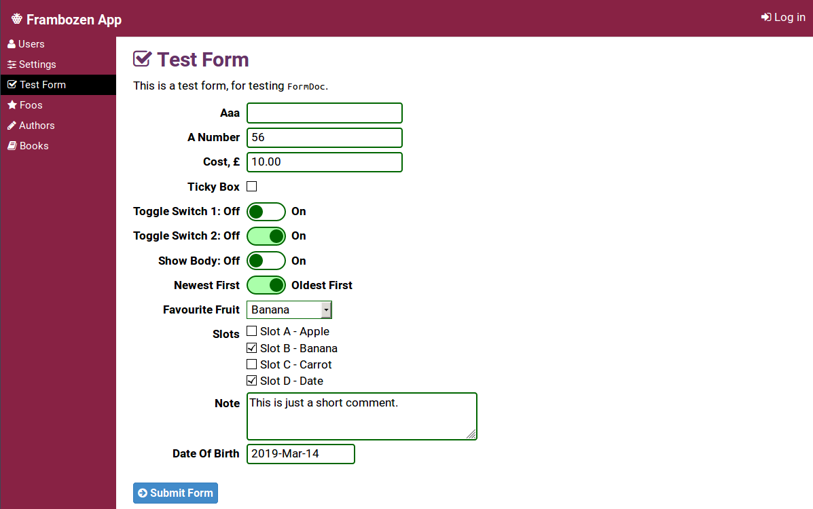
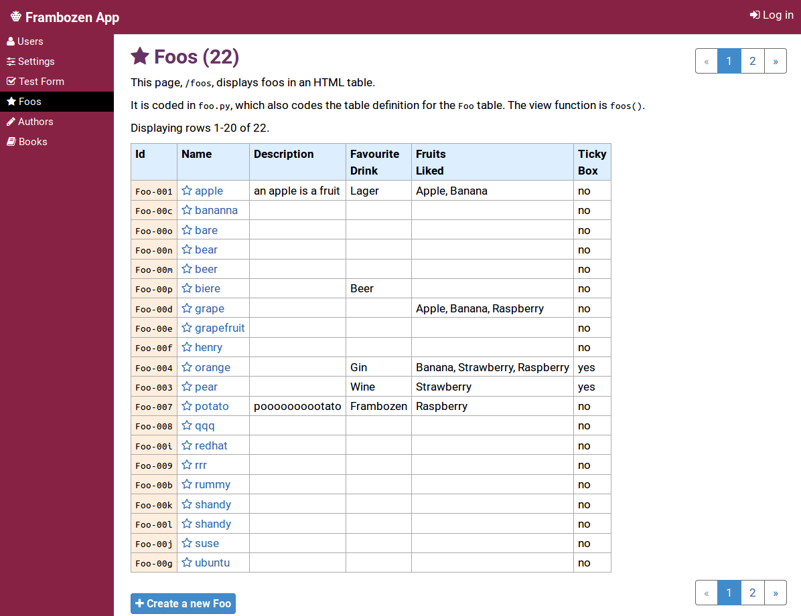
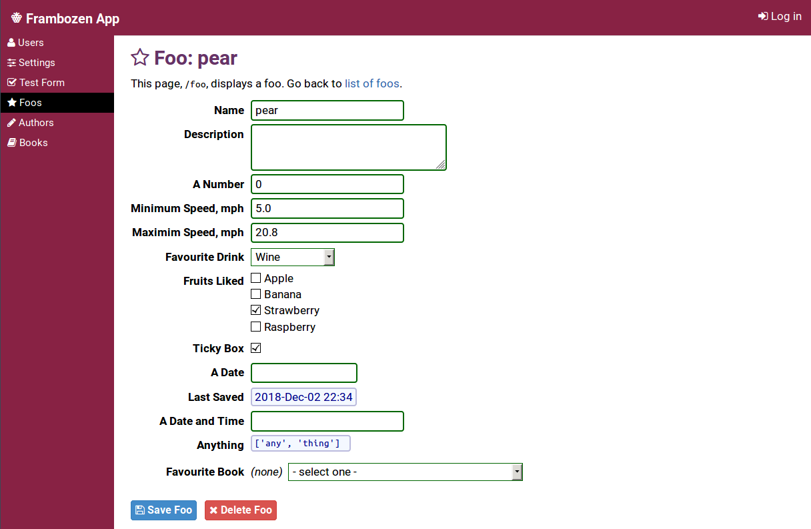

# Frambozenapp

**Frambozenapp** is a Python web application that showcases the
**frambozen** library.

## About Bozen

## Installation

Requirements: Python 3.6, MongoDB, Git (to clone repository).

To start, first clone the repository locally.

    $ git clone git@github.com:cabalamat/frambozenapp.git
    $ cd frambozenapp
    
Create a virtual environment called `v3`:

    $ python3 -m venv v3
    
Go into your virtual environment:

    $ . v3/bin/activate
    
Install the requirements:

    $ pip install -r requirements.txt

Finally, go into the `app/` directory and run the program. The
`--debug` flag denotes that you are running it in debugging mode.
    
    $ cd app
    $ python main.py --debug

Now you can point your web browser at <http://127.0.0.1:9033> to
view the site.

## Documentation

Documentation is available in the `./doc/` directory. It's in the 
extended markdown format that 
[CatWiki](https://github.com/cabalamat/catwiki) uses 
(and was created in CatWiki), so is best viewed with CatWiki.

## Screenshots

**Test Form** shows some of the form controls:



The **Foos** page shows a list of *Foos* (Foo being a collection
in the database).



The **Foo** page shows a single *Foo*, and allows you to edit its 
fields. The form is automatically denerated from the database schema
(in `foo.py`):

```py
DRINK_CHOICES = [
    ('beer', "Beer"),    
    ('beer-lager', "Lager"),   
    ('beer-frambozen', "Frambozen"), 
    ('wine', "Wine"),         
    ('spirits-whisky', "Whisky"),   
    ('spirits-gin', "Gin"), 
] 
FRUIT_CHOICES = [
    ('apple', "Apple"),
    ('banana', "Banana"),
    ('strawberry', "Strawberry"),
    ('raspberry', "Raspberry"),
]

class Foo(MonDoc):
    name = StrField()
    description = TextAreaField(monospaced=True)
    aNumber = IntField(minValue=0, maxValue=100)
    minSpeed = FloatField(title="Minimum Speed, mph", minValue=0.0)
    maxSpeed = FloatField(title="Maximim Speed, mph", minValue=0.0)
    favouriteDrink = ChoiceField(choices=DRINK_CHOICES,
        showNull=True, allowNull=True)
    fruitsLiked = MultiChoiceField(choices=FRUIT_CHOICES,
        desc="tick all fruits this person likes") 
    tickyBox = BoolField()
    aDate = DateField()
    lastSaved = DateTimeField(desc="when this foo was last saved",
        readOnly=True)
    aDateTime = DateTimeField(title="A Date and Time")
    anything = ObjectField(desc="can contain anything",
        default=["any", "thing"])
    favouriteBook = FK(models.Book, allowNull=True, showNull=True)
```




