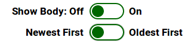

# BoolField

**BoolField** is a [[FieldInfo]] subclass.

Its data type is a `bool`. Its form element is an checkbox, with the HTML looking like this:

```html
<input id="id_tickyBox" type="checkbox" name="tickyBox">
```

## Toggle Switch

There is also a **toggle switch** variant of how a `BoolField` is displayed; this is set by setting the parameter `widget` to the value `'toggleSwitch'. Example:

```py
class MyForm(FormDoc):
    showBody = BoolField(widget='toggleSwitch')
    order = BoolField(widget='toggleSwitch',
        showTitle = False,
        onText = "Oldest First",
        offText = "Newest First")
```

Note that in toggle switches, the Off/False position is to the left and the On/True position is to the right. This form would be rendered something like this:



### Toggle Switch parameters

`widget:str`, defaults to `'checkbox'` = what widget to use for the field. Values are `'checkbox'` or `'toggleSwitch'`

`onText:str`, defaults to `"On"` = text for the On/True position

`offText:str`, defaults to `"Off"` = text for the Off/False position

`showTitle:bool`, defaults to `True` = if `True`, shows the title to the left of the `offText`. If `False`, doesn't show the title.


## Parameters

*See also Toggle Switch Parameters above.*

`desc:str` = A description of the field. This is used as a comment and is displayed as a tooltip on the field title as it appears on the page (using the HTML `title` attribute)

`title:str` = The text description that will appear against a field on a web form. This defaults to a name based on the field name in the table schema.

`default:str` = the default value that goes in the field. 

`displayInForm:bool` = whether the field is to be rendered in a form built with `doc.buildForm()`  or `doc.buildFormLines()`.
