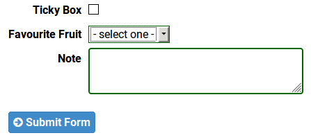
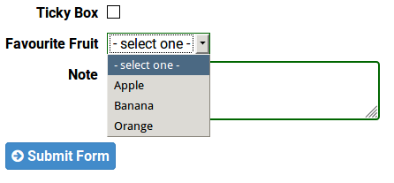
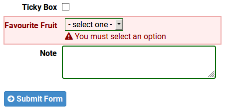

# ChoiceField

**ChoiceField** is a [[FieldInfo]] subclass. A ChoiceField, when rendered, looks like an HTML drop-down box with choices of which the use selects one.

## Example

This form includes 3 fields, the middle one of which is a ChoiceField.

```py
FRUIT_CHOICES = [
    ('apple', "Apple"),
    ('banana', "Banana"),
    ('orange', "Orange"),
]
class MyForm(FormDoc):
    tickyBox = BoolField()
    favouriteFruit = ChoiceField(choices=FRUIT_CHOICES,
        showNull=True, allowNull=False)
    note = TextAreaField()
```

When rendered it might look like this:



When the user clicks on the select element, it might look like this:



The HTML to render the *Favourite Fruit* line in the form looks something like this:
```html
<tr class='favouriteFruit_line '>
    <th class='bz-field-title'>
      <label for="id_favouriteFruit" title="">Favourite Fruit</label></th>
    <td><select id='id_favouriteFruit' name='favouriteFruit'>
<option value='' selected='selected'>- select one -</option>
<option value='apple'>Apple</option>
<option value='banana'>Banana</option>
<option value='orange'>Orange</option>
</select>
</td>
</tr>
```

### Functionality

In the example, `showNull=True` meaning there is a "- select one -" option at the top, and `allowNull=False` which means the user must select one of the other options, otherwise the form is invalid and an error message is displayed:



## Parameters

`choices`:`List[Tuple[str,str]]` **COMPULSORY** = the choices in the selection box. For each tuple, the database value is defined followed by the display value.

`desc`:`str` = A description of the field. This is used as a comment and is displayed as a tooltip on the field title as it appears on the page (using the HTML `title` attribute)

`title`:`str` = The text description that will appear against a field on a web form. This defaults to a name based on the field name in the table schema.

`default`:`str` = the default value that goes in the field. If not set, it is the value of the 0th choice in `choices`.

`showNull`:`bool` defaults to `False` = if true, the list of elecment begibns with a null element of `('',"- select one -")`

`allowNull`:`bool` defaults to `True` = if true, allows the user to select the null (`''`) element